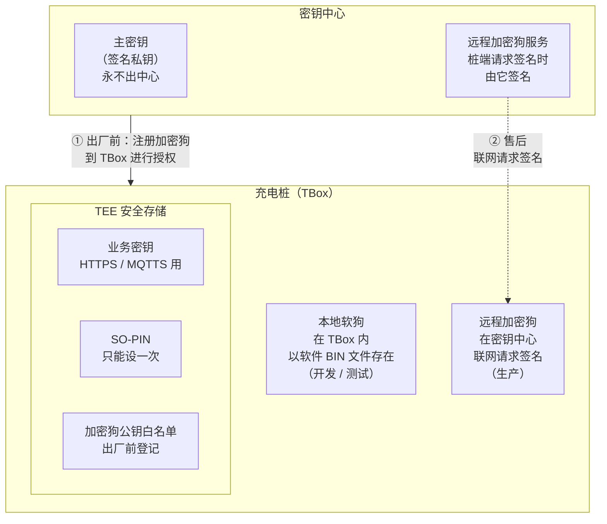

# 34 — 云端上位机与 TBox 设备的逻辑关系（密钥灌装 · 售后维护）

> **本文回答一个问题**：云侧和桩端**各自负责什么、在哪一步交接、谁信谁**。
>
> **不重复操作细节**——具体命令见 [docs/33 部署手册](33-deployment-guide.md) §18/§19；
> 信任模型的完整论证见 [docs/29](29-rsa-yubikey-provisioning.md)。

---

## 0. 一句话概括

**桩上的业务密钥锁在芯片内的 TEE 安全存储里；想打开它，要 "SO-PIN + 加密狗" 两样都对。**

密钥中心只负责一件事：**桩端请求签名时，用它保管的主密钥对该请求签名**。
业务密钥本身、认可哪只加密狗，都只存在桩端 —— 密钥中心看不到、也改不了。

| | 密钥中心 | 充电桩（TBox） |
|---|---|---|
| **出厂前** | 提供加密狗公钥给产线 | 生成业务密钥、设置 SO-PIN、**注册加密狗到 TBox 进行授权** → **上锁** |
| **售后** | 桩端联网请求签名，就签一个 | **自己判断** SO-PIN 对不对、狗在不在白名单里 |

> **关键**：密钥中心**拿不到桩端的业务密钥**，桩端也**不需要"信任"密钥中心** ——
> 放不放行，是 TEE 内部说了算，密钥中心只提供签名。

---

## 1. 谁负责什么

> 这一节用的是技术术语，做安全设计时看。**只想理解大意的读者可以跳过到 §2。**

| 角色 | 在哪 | 能不能信 | 负责什么 |
|---|---|:--:|---|
| **IT 管理员** | 密钥中心 | 半信（双人 + 留痕约束） | 管主密钥 |
| **可信服务器** | 密钥中心（断网、整盘加密） | 隔离环境 | 存放主密钥的地方 |
| **签名服务器** | 密钥中心（联网） | **不信** | 认证来请求签名的充电桩、限速、签名、记日志 |
| **安全官员** | 现场 | **不信** | 带狗到现场、记着 SO-PIN |
| **产线工控机** | 产线 | **不信**（第三方维护） | 搬灌装材料、跑灌装脚本 |
| **桩端普通程序** | 桩端（安全区外） | **不信**（可被替换） | 把桩端请求转给密钥中心、把签名结果递进 TEE |
| **TEE**（安全存储） | 桩端（芯片安全区） | ✅ **唯一可信** | 验签、查加密狗白名单、保管业务密钥 |

> **为什么要这么设计**：把"可能被攻陷"的角色尽量多列出来（工控机、安全官员、
> 桩端普通程序全都不信），只留 **TEE** 一个可信点。
>
> 结果就是：**攻击者换掉桩上的程序、还拿到了 SO-PIN —— 只要他没有白名单里的那只加密狗，
> TEE 照样拒绝解锁。**

---

## 2. 总体架构



### 三句话读懂这张图

**① 业务密钥锁在芯片内的 TEE 里。**

桩上的业务密钥（HTTPS、MQTTS 要用的那把）存在 **TEE 安全存储**里 —— 这是芯片内部的一块安全区域，
**外面的程序看不见、也拿不走**；用它的时候不必把密钥取出来，直接把运算交给 TEE 完成。

**② 想解锁，SO-PIN 和加密狗两样都要对。**

一个是 **SO-PIN**（出厂时设置，只能设一次），另一个是**加密狗**。
只有 SO-PIN 正确、且加密狗在白名单里，TEE 才解锁。**缺一样都打不开。**

**③ 加密狗有两种，区别只在"狗放在哪"。**

| | 本地软狗 | 远程加密狗 |
|---|---|---|
| 狗放在哪 | **TBox 内，以软件 BIN 文件形式存在** | **密钥中心**，桩端联网请求它签名 |
| 能否被复制 | **能** —— 拿到 TBox 就能把那个 BIN 文件复制走 | **不能** —— 狗从不出密钥中心 |
| 用在哪 | 开发、测试 | **生产、售后** |

> **为什么要有"远程"这种？** 本地软狗是把**签名私钥以软件 BIN 文件形式存放在 TBox 内**的 ——
> 谁能拿到 TBox，谁就能把那个文件复制走。生产环境不能这么干，所以把"签名"这件事挪到密钥中心，
> 桩端只在需要时联网请求一次。

### 出厂前 / 维修时，各做什么

```
出厂前（只做一次）                维修时（售后）
──────────────────                ────────────────
① 生成业务密钥                    ① 输入 SO-PIN
② 设置 SO-PIN（只能设一次）       ② 接入加密狗（本地或联网）
③ 登记加密狗白名单                ③ TEE 解锁，执行维护操作
④ 上锁 —— 之后写操作全禁          ④ 修完手动 --so-lock 锁回
                                  （★ 不会自动锁）
```

> ⚠️ **两件事必须记住**：
> - **SO-PIN 丢失 + 没有白名单里的加密狗 = 这台充电桩永久锁死**（SO-PIN 只存在桩端，密钥中心没有备份）
> - **维护完必须手动锁回** —— 目前不会自动锁，忘了锁就相当于一直开着

---

## 附：术语对照

本文用的是**业务侧术语**，与其他文档 / 代码的对应关系：

| 本文 | 其他文档 / 代码里的说法 |
|---|---|
| 密钥中心 | 上位机 / 签名服务器（`tbox-dongle-sign`）；可信服务器为其保管主密钥 |
| 主密钥 | 签名母钥（RSA-2048 私钥） |
| TEE 安全存储 / TEE | TEE 安全世界 / TA（`tbox_keystore`） |
| TEE 外面的程序 | REE 普通世界 / CA（`keystore` 命令） |
| 业务密钥 | RSA-2048 / AES 密钥（HTTPS、MQTTS 用） |
| SO-PIN | `--init-so-pin` 设置，`--so-unlock` 使用 |
| 加密狗 | dongle（`dummy.so` / `remote.so`） |
| 本地软狗 | 形态 A / `dummy.so` |
| 远程加密狗 | 形态 B / `remote.so` / 远程签名狗 |
| 登记加密狗 | `--provision-dongle` / `--provision-dongle-from-file` |
| 加密狗白名单 | 公钥白名单（`SO_DONGLE_MAX` = 8 条） |
| 签名 | 数字签名（在 `CMD_SO_UNLOCK_CONFIRM`(18) 内验证） |
| 上锁 / 锁回 | `--lock` / `--so-lock` |
| 售后解锁 | `--so-unlock` |
| 解锁状态 | `UNLOCKED` |
---

## 3. 密钥灌装

### 3.1 时序图

```
  产线工控机          充电桩（TBox · CA → TA）        密钥中心
   （不可信）           （REE 不可信 / TEE 可信）   （提供公钥）
      │                        │                              │
      │① 部署程序 + 插件       │                              │
      │───────────────────────▶                               │
      │                        │                              │
      │② --init-pin            │ PIN_INIT(0)                  │
      │───────────────────────▶                               │
      │                        │                              │
      │③ --init-so-pin         │ SO_PIN_INIT(12)              │
      │───────────────────────▶                               │
      │                        │                              │
      │④ --gen-rsa …           │ KEY_GEN_RSA(1)               │
      │───────────────────────▶                               │
      │                        │                              │
      │⑤ --provision-dongle    │ PROVISION_DONGLE(13)         │
      │   形态 A：dummy.key    │ → 写入 TA 白名单             │
      │   形态B：公钥由云侧提供│                              │
      │                        │                              │
      │⑥ --so-info             │ SO_GET_INFO(17)              │
      │───────────────────────◀                               │
      │                        │ → PROVISIONED / N dongle     │
      │                        │                              │
      │⑦ --lock ★              │ PROVISION_LOCK(10)           │
      │───────────────────────▶                               │
      │                        │ → LOCKED，写保护开启         │
      │                        │                              │
    出厂                   LOCKED                        审计留痕
```

### 3.2 三条硬性顺序约束

> 违反任意一条，灌装就会失败且**不可逆**（[docs/33 §18](33-deployment-guide.md)）：

| # | 约束 | 原因 |
|:-:|---|---|
| 1 | `--init-pin` / `--init-so-pin` **各只能一次** | `pin_mgr_init()` 在已初始化时返回 `ACCESS_DENIED` |
| 2 | `--init-so-pin` **必须在** `--so-unlock` **之前** | 没有 SO-PIN 无法解锁；而锁定后写操作被禁 |
| 3 | `--provision-dongle*` **必须在** `--lock` **之前** | `--lock` 后写保护生效，登记白名单也属于写操作 |

**根因**：`--lock` 是**单向门**——它开启写保护，而解锁需要先有 SO-PIN 和白名单。
**所以在 `--lock` 之前必须把"将来解锁所需的一切"都准备好。**

### 3.3 云侧提供什么 / 桩端固化什么

| | 形态 A（本地软狗） | 形态 B（远程签名狗） |
|---|---|---|
| **云侧提供** | 无（不需要云侧） | 签名服务器的 **RSA-2048 公钥 DER** |
| **桩端固化进 TA** | `dummy.key` 对应的公钥 | 签名服务器母钥对应的公钥 |
| **私钥在哪** | **在设备上**（`dummy.key` 文件） | **只在云侧可信服务器** |
| **适用** | 开发 / 测试 / 离线 | **生产 / 现场** |

> ⚠️ **形态 A 的私钥就在桩端**——拿到设备的人可以直接复制它。
> 所以形态 A **只能用于开发**，生产必须用形态 B（见 [docs/32](32-dongle-plugin-architecture.md) §10）。

### 3.4 灌装后设备"记得"什么

灌装完成后，这些状态**持久化在 TEE 存储里**，云侧**无法读也无法改**：

| 状态 | 说明 |
|---|---|
| PIN 哈希 | 业务操作的普通门禁 |
| SO-PIN 哈希 | 售后解锁的第一因子（**丢了就再也解不开**） |
| 业务密钥 | RSA-2048 / AES，私钥永不出 TEE |
| 狗公钥白名单 | 最多 **8** 条（`SO_DONGLE_MAX`） |
| SO 状态 | `LOCKED` |
| 失败计数器 | 初始 `0 / 0` |

> ⚠️ **SO-PIN 必须归档**。它只在设备侧存哈希，
> **云侧没有备份、也无法重置**——丢了且没有白名单里的狗 = 设备永久锁死。

---

## 4. 售后维护

### 4.1 时序图（两阶段解锁）

```
   安全官员        充电桩（TBox · CA → TA）       密钥中心
    （不可信）   （REE 不可信 / TEE 可信）         （签名服务）
     │                    │                                  │
     │ ① --so-info        │ SO_GET_INFO(17)                  │
     │───────────────────◀                                   │
     │                    │ → LOCKED / N dongles             │
     │                    │                                  │
     │ ② --so-unlock      │ ══ Phase 1 ══                    │
     │    --so-pin <hex>  │ SO_UNLOCK_REQ(14)                │
     │    --dongle remote │ → 校验 SO-PIN 哈希               │
     │───────────────────▶                                   │
     │                    │ → 生成 challenge(32B)            │
     │                    │ → 返回 challenge + 条目数        │
     │                    │                                  │
                          │─────────────────────────────────▶
     │                    │ ③ 桩端送 SHA256(challenge)       │
     │                    │      ④ 认证调用方（SSH 指纹）    │
     │                    │         查白名单/限频，母钥签名  │
                          │─────────────────────────────────◀│
     │                    │ ◀── 返回 {pubkey_der, sig}       │
     │                    │                                  │
     │ ⑤ CA 提交          │ ══ Phase 2 ══                    │
     │                    │ SO_UNLOCK_CONFIRM(18)            │
     │───────────────────▶                                   │
     │                    │ ★ TA 内原子完成：                │
     │                    │    RSA-2048 验签                 │
     │                    │    ∧ 公钥在白名单中              │
     │                    │    → 都通过才 UNLOCKED           │
     │                    │                                  │
     │ ⑥ 维护操作         │ KEY_GEN_RSA / KEY_DELETE …       │
     │───────────────────▶                                   │
     │                    │ → 写保护已解除                   │
     │                    │                                  │
     │ ⑦ --so-lock ★      │ SO_LOCK(16)                      │
     │───────────────────▶                                   │
     │                    │ → LOCKED                         │
     │                    │                                  │
    离场              LOCKED                        审计日志留痕
```

### 4.2 为什么必须两阶段

| 阶段 | 做什么 | 关键点 |
|:--:|---|---|
| **Phase 1** | 交 SO-PIN，换回一个**随机 challenge** | challenge 每次不同，**防重放** |
| **Phase 2** | 交 challenge 的签名 + 签名者公钥 | TA **原子**做"验签 ∧ 查白名单" |

> **为什么 CA 可以被替换也不怕**：CA 只负责**中转**（把 challenge 送到云侧、
> 把签名交回 TA）。就算攻击者换掉 CA 二进制、也拿到了正确的 SO-PIN，
> **他没有白名单里的那把狗的私钥**，云侧（或本地软狗）签不出有效签名 → TA 拒绝。
>
> 这是把"验签 + 白名单匹配"放进 TA 的**唯一目的**：让决策不依赖任何 REE 组件。

### 4.3 状态机

```
   UNSET
      │ --init-so-pin(12)  灌装 SO-PIN（一次性）
      ▼
   PROVISIONED                                  灌装完成、尚未锁定
      │ --lock(10)
      │ ★ 单向门：之后写操作全禁
      ▼
   LOCKED  ◀────────────────┐                   出厂状态
      │                     │
      │ --so-unlock(14→18)  │  --so-lock(16)
      │ SO-PIN + 狗签名     │
      │ TA 内：验签∧白名单  │
      ▼                     │
   UNLOCKED─────────────────┘                   写保护解除，可维护
      │
      │ 解锁尝试失败累计 1000 次
      ▼
   BRICKED                                      永久，无恢复路径
```

### 4.4 失败计数与防爆破

| 规则 | 值 | 行为 |
|---|:--:|---|
| 连续失败上限 | **3** 次 | 触发冷却 |
| 冷却时长 | **60** 秒 | 期间拒绝任何解锁尝试 |
| 累计失败上限 | **1000** 次 | → **BRICKED**，永久报废 |

> 失败计数器**持久化在 TEE**，重启、断电解锁尝试都无法清零。
> 这是防"把设备抱回去慢慢试 SO-PIN"的设计。

### 4.5 ⚠️ 解锁不会自动过期

> **设计中提到的空闲超时尚未实现。** 解锁后如果不手工 `--so-lock`，
> **写保护会一直开着**。
>
> ✅ **请把"维护完必锁"写进作业规范**——这目前是流程约束，不是技术约束。

---

## 5. 两条线的对照

| | 密钥灌装 | 售后维护 |
|---|---|---|
| **触发** | 产线，每台一次 | 现场，按需 |
| **设备状态** | `UNSET` → `PROVISIONED` → `LOCKED` | `LOCKED` ↔ `UNLOCKED` |
| **云侧参与** | 提供狗公钥 DER（**离线搬运**） | 提供 challenge 签名（**在线**） |
| **云侧拿得到什么** | 无（只有自己签发的公钥） | 只有 challenge 的哈希 |
| **桩端信任云侧吗** | 不需要——公钥固化后即可 | **不需要**——TA 自己验签 |
| **不可逆点** | `--lock`（单向门） | `BRICKED`（1000 次失败） |
| **最大风险** | SO-PIN 未归档 + 狗未登记 | 忘 `--so-lock`；SO-PIN 泄露 |

---

## 6. 边界与限制（如实告知）

| # | 限制 | 影响 |
|:-:|---|---|
| 1 | **解锁无自动超时** | 依赖作业规范，非技术强制 |
| 2 | **`--init-*` 各只能一次** | 灌装错了只能换设备或走恢复流程（[docs/14](14-brick-recovery-and-best-practices.md)） |
| 3 | **白名单上限 8** | 超过需换狗策略 |
| 4 | **SO-PIN 无云端备份** | 丢了 + 无狗 = 永久锁死 |
| 5 | **批量 manifest 灌装未实现** | 目前逐台 `--provision-dongle-from-file`（[docs/29](29-rsa-yubikey-provisioning.md)） |
| 6 | **形态 A 私钥在桩端** | 仅限开发，生产必须形态 B |
| 7 | **云侧在线依赖** | 形态 B 下网络不通则无法解锁——**刻意不回退到本地软狗**（否则等于开后门） |

---

## 7. 相关文档

| 文档 | 内容 |
|---|---|
| [docs/32](32-dongle-plugin-architecture.md) §3 | dongle 子系统总体架构（本文的架构参考基准） |
| [docs/33](33-deployment-guide.md) §18 / §19 | 灌装 / 解锁的**操作细节** |
| [docs/29](29-rsa-yubikey-provisioning.md) §1 | 角色定义与信任模型的完整论证 |
| [docs/28](28-yubikey-full-lifecycle.md) | 完整生命周期与安全缺口分析 |
| [docs/07](07-provisioning-procedure.md) | 产线灌装的详细时序（含安全启动） |
| [docs/14](14-brick-recovery-and-best-practices.md) | 变砖恢复 |
